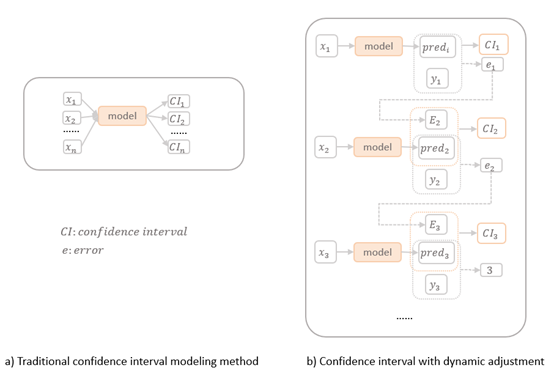
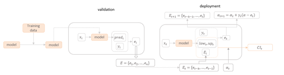

# CONTINA: Conformal Traffic Intervals with Adaptation

## Introduction
Accurate short-term traffic demand prediction is critical for the operation of traffic systems. Beyond point estimation, providing confidence intervals for predictions is equally essential, as many traffic management models—such as shared bike rebalancing and taxi dispatching—require uncertainty quantification to optimize operations. 

Existing methods for confidence interval modeling often assume that traffic patterns during deployment match those in training data. However, this assumption does not hold in dynamically changing traffic environments, leading to coverage failures. To address this issue, we propose **CONTINA (Conformal Traffic Intervals with Adaptation)**:

- **Adaptive Adjustment:** By collecting errors of intervals during deployment, CONTINA dynamically adjusts interval widths based on observed errors, with adaptive rates tailored to regions experiencing different traffic pattern changes.
- **Theoretical Guarantees:** CONTINA provides coverage guarantees even for regions with the worst coverage, ensuring robust results.
- **Model Agnostic:** CONTINA can be applied to any prediction model to improve its reliability and usability.
## Comparison and Method Details

### Comparison with Traditional Methods

The following figure illustrates the comparison between CONTINA and traditional methods:

  

### CONTINA Method Details

The figure below provides an overview of the CONTINA method:

  

## Repository Overview

This repository contains the implementation of CONTINA and experiments described in the paper. All code and data required to reproduce the results are included (based on pytorch).

### Steps to Reproduce
Just executing all codes in conformal.ipynb can reproduce the results.

## Citation
...
